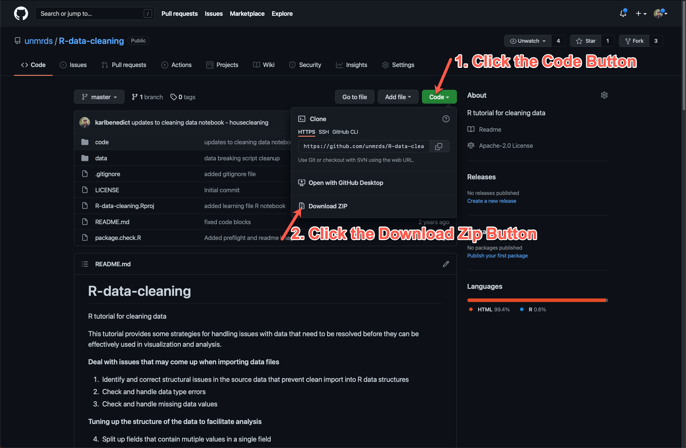
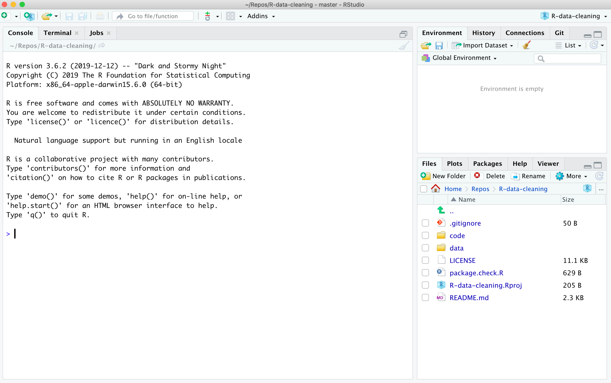

# R-data-cleaning
R tutorial for cleaning data

This tutorial provides some strategies for handling issues with data that need to be resolved before they can be effectively used in visualization and analysis. 

Shared [RStudioCloud](https://rstudio.cloud/) version that you can copy into your account to work with: [https://rstudio.cloud/project/3081275](https://rstudio.cloud/project/3081275)

**Deal with issues that may come up when importing data files**

1. Identify and correct structural issues in the source data that prevent clean import into R data structures
2. Check and handle data type errors
3. Check and handle missing data values

**Tuning up the structure of the data to facilitate analysis**

4. Split up fields that contain mutiple values in a single field
5. Check for anomalous values and otherwise explore the data to become familiar with its content and structure. 

The data used in this workshop are a modified version of the [idigbio_rodents.csv](https://figshare.com/articles/idigbio_rodents_csv/5535724) dataset. The data have been modified to illustrate some common problems with datasets that will be addressed in the workshop. 

## Preparation for the workshop

Prior to the workshop you will need to perform the following steps:

1. Download this repository to a folder on your local computer, either as a ZIP archive (see figure below illustrating where to click in the GitHub repository to download the zipfile) or through `git clone` on your computer. If you download the repository as a ZIP archive you will need to uncompress it to work with the collection of files. 



2. Install the most recent version of R supported by your operating system from the [Comprehensive R Archive Network](https://cran.r-project.org) (CRAN). If you already have R installed on your computer you might consider updating it to a more recent version if it is very old. 

3. Install the most recent version of [RStudio Desktop](https://rstudio.com/products/rstudio/) for your operating system. 

4. Test your installation of RStudio by opening it through the "Start Menu" in Windows, or the "Applications" folder on a Mac. If you installation was successful in linking R project files with RStudio you can also double-click the `R-data-cleaning.Rproj` file in the top folder of the uncompressed ZIP archive that you downloaded in step (1) above. If you have succeessfully installed and run RStudio you should see a window that looks like the following:



5. Install the required R packages (if they are not already installed on your system - if they are already installed you will be told this when executing these commands) by executing the following commands in the R Console:

```R
install.packages("tidyverse")
install.packages("mice")
install.packages("VIM")
install.packages("assertr")
```

6. Test that the packages have been properly installed on your system and can be loaded by running the `package.check.R` script in the top folder of the workshop R project. You can run the script by executing the following command from the R Console:

```R
source('package.check.R', echo=TRUE)
```

If you have successfully installed the required libraries you will see output that looks similar to the following:

```R
> #code by vikram b baliga
> #https://www.vikram-baliga.com/blog/2015/7/19/a-hassle-free-way-to-verify-that-r-packages-are-installed-and-loaded
> 
> # .... [TRUNCATED] 

> #use this function to check if each package is on the local machine
> #if a package is installed, it will be loaded
> #if any are not, the missing p .... [TRUNCATED] 

> #verify they are loaded
> search()
 [1] ".GlobalEnv"         "package:assertr"    "package:VIM"        "package:data.table" "package:grid"      
 [6] "package:colorspace" "package:mice"       "package:forcats"    "package:stringr"    "package:dplyr"     
[11] "package:purrr"      "package:readr"      "package:tidyr"      "package:tibble"     "package:ggplot2"   
[16] "package:tidyverse"  "tools:rstudio"      "package:stats"      "package:graphics"   "package:grDevices" 
[21] "package:utils"      "package:datasets"   "package:methods"    "Autoloads"          "package:base"  
```

You should see the following entries in the output of the final `search()` command in the outpout:

```R
"package:assertr"
"package:VIM"
"package:mice"
"package:tidyverse"
```

If you hadn't previously installed the needed packages you might also see output related to installation and loading of the packages. 

## Workshop Content

The workshop materials are found in two directories within the downloaded repository. Specifically, the data that we will be working with are found in the `data` folder, and the sample code we will be working through is found in the `code` folder. The specific files that we will be working with are:

```
data/learning_struct.csv  # for working through structural problems in sourc data files
data/learning.csv # for the rest of the practice, representing source data for which the structural issues have been resolved

code/cleaning_data.Rmd  # the R markdown version of the workshop content from which other representations can be generated
code/cleaning_data.html # an HTML rendering of the R markdown sample code and output that is more readable
doce/cleaning_data.R    # an R script containing only the executed R code extracted from the R markdown `cleaning_data.Rmd`
```

The additional files in the `data` and `code` directories consist of the source CSV file (`data/rawData.csv`) from which the data file with problems was generated, and the R code (`code/breaking_data.Rmd` and the associated `code/breaking_data.html`) that was used to generate the problem files used in the workshop. 
  
