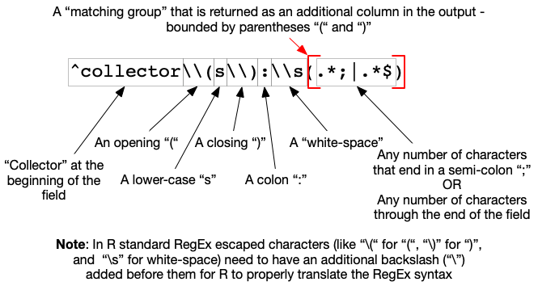

```{r setup, include=FALSE}
knitr::opts_chunk$set(echo = TRUE)
```

## Cleaning Data In R

GitHub Repository with this demonstration: [https://github.com/unmrds/R-data-cleaning](https://github.com/unmrds/R-data-cleaning)

Zipfile Download: [https://github.com/unmrds/R-data-cleaning/archive/master.zip](https://github.com/unmrds/R-data-cleaning/archive/master.zip)

Check out the **Preflight Check** to see if you have the needed R libraries installed run the `package.check.R` script in the top directory of this R project. This script will check to see if the packages are installed, and if they are not will do so. The script finishes with a listing of the currently installed packages so you can verify that the packages we need are installed. Check out the [README.md](https://github.com/unmrds/R-data-cleaning/blob/master/README.md) file in the [workshop repository](https://github.com/unmrds/R-data-cleaning) for full setup instructions. 

When planning a data analysis the first step, and often most time consuming, is the acquisition and processing of the data into a form that can be used in the analytic procedures you intend to use. Today we are going to focus on a sequence of steps that generally follow the workflow that you will find yourself going through when bringing data into R to perform an analysis. 

 ] workflow](images/tidy_workflow.png)

### Deal with issues that may come up when importing data files

1. Identify and correct structural issues in the source data that prevent clean import into R data structures
2. Check and handle data type errors
3. Check and handle missing data values

### Tuning up the structure of the data to facilitate analysis

4. Split up fields that contain mutiple values in a single field
5. Check for anomalous values and otherwise explore the data to become familiar with its content and structure. 

*Beyond what we will cover today* - continued structural changes and the rest of the exploration, analysis, and communication process. 

### Data for today's demonstration

The data for this demonstration are based upon the [idigbio_rodents.csv](https://figshare.com/articles/idigbio_rodents_csv/5535724) dataset. The data are described as follows in the repository where they are shared:

> The idigbio_rodents.csv dataset is just over 10k records and contains data from natural history collections specimen records representing 5 genera from 4 major US collections, limited to US records. All records are from the Order Rodentia. All the data are mapped to the biodiversity data standard Darwin Core (http://rs.tdwg.org/dwc/terms/).

The original data have been modified for use in this demonstration by:

1. Generating new data columns (`latDMS` and `lonDMS`) for latitude and longitude that have sample coordinates presented in Degrees-Minutes-Seconds instead of the originally provided decimal degrees.
2. Generating a column of mixed numeric and text values - `textLatDD`. 

This is the `../data/learning.csv` file. These newly created columns in addition to some of the originally provided ones will be used to demonstrate a variety of data cleaning steps in R.

An additional file was developed that only includes the first 10 rows of the file (including headers) but introduces a strucutral error. This file is the `../data/learning_struct.csv` file. 

### R libraries used in the demonstration

For this demonstration a set of R packages that are part of the [*Tidyverse*](https://www.tidyverse.org). The tidyverse collection of packages provide (as described on the project's homepage):

> an opinionated collection of R packages designed for data science. All packages share an underlying design philosophy, grammar, and data structures. 

There are currently over 14,000 R [packages](https://cran.r-project.org/web/packages/index.html) in the [Comprehensive R Archive Network (CRAN)](https://cran.r-project.org/index.html). While the tidyverse packages provide a useful degree of consistency and internal interoperablity it is strongly encouraged to examine the broad collection of R packages when working on a particular analysis problem. 

If you need to install the tidyverse packages in your enviornment you can execute the `install.packages("tidyverse")` command. 

## 1. Identify and correct structural issues in the source data that prevent clean import into R data structures

R can import a wide variety of *rectangular* data structures: comma-delimited, tab-delimited, excel spreadsheets, fixed-width among the many options. If there are errors in the structure of these files, R import commands may not be able to parse the lines in the data file preventing import. In these cases the returned error messages may provide some clues to where the errors may be found.  

**One strategy for identifying potential strucutral issues in the source file is to try to import the dataset and review any errors that are returned**

Let's try it first with a small file ...

```{r}
library(tidyverse)

# Import the source CSV file that contains a structural flaw
rawDataStruct <- read_csv("../data/learning_struct.csv", 
                    progress = FALSE)

# Display the column definitions for the imported dataset
spec(rawDataStruct)

# Report the problems that were encountered when the data were imported.
problems(rawDataStruct)

# Display the imported table
rawDataStruct
```

Let's take a look at the source data file and see if we can find the problem...

Now let's try it with the full dataset for which the structural problem has been resolved. 

```{r}
library(tidyverse)

# Import the source CSV file that does not contain the structural problem highlighted above
rawData <- read_csv("../data/learning.csv", 
                    progress = FALSE)

# Display the column definitions for the imported dataset
spec(rawData)

# Report the problems that were encountered when the data were imported.
problems(rawData)

# Display the imported table
rawData
```

Some questions:

1. How do the data types for the columns from this import process differ from those in the previous subset (at least before we fixed it)? Why do you think this is the case?
2. Where there any errors identified during the import? If no, does this mean that there are no potential problems or issues with the imported data? **Let's take a look**
3. How would you explain the values in the `eventDate` column when compared to the `year`, `month`, and `day` columns?
4. What were the different ways in which missing data values were handled?

## 2. Checking and handling data type errors

Depending on the types of data that are encountered in each column of the imported dataset different R import functions will automatically "type" the column (or in R terminology set the "mode" of the column) based on some sample of rows from the source file. In the case of `readr`, the data reading package used by tidyverse, the first 1000 lines of data will be read to determine the data type that should be used for each column. The core R data types are:

* character
* numeric (real or decimal)
* integer
* logical
* complex

These core data types can then be used as the foundation for more complex data types such as *dates*, *times* and *datetimes*. 

The core data structures that can be used to organize collections of these data types include:

* vector - a sequence of data values of the same type
* list - a sequence of data values of the same or different types, and structures
* matrix - a vector for which *dimensions* 
* data frame - a structured collection of vectors of the same length
* factors - a vactor vector is a set of integer values that are associated with a collection of categorical character values

Let's focus on the `catalogNumber` and `textLatDD` columns in our sample datasets. 

```{r}
spec(rawData)
rawData %>%
  select(catalogNumber,textLatDD)
```


```{r}
# test the creation of a numLatDD column as a numeric column and see what rows were converted to NA
rawData %>%
  mutate(numLatDD = as.numeric(rawData$textLatDD)) %>%
  filter(is.na(numLatDD)) %>%
  select(textLatDD, numLatDD) %>%
  print() %>%
  group_by(textLatDD) %>%
  summarize(count = n()) 

```

```{r}
# create a numeric column based on the previously tested conversion of the textLatDD column
rawData$numLatDD <- as.numeric(rawData$textLatDD)
rawData
```

We can also accomplish a similar outcome by specifying the column type that should be created as part of the import process. 

```{r}
rawData2 <- read_csv("../data/learning.csv", 
                     col_types = cols(
                        textLatDD = col_double()
                        ),
                     progress = FALSE)

# Display the column definitions for the imported dataset
spec(rawData2)

# Report the problems that were encountered when the data were imported.
problems(rawData2)

# Display the imported table
rawData2
```

```{r}
# convert the catalogNumberTxt column to a character column and see what the result is
rawData %>%
  mutate(catalogNumberTxt = as.character(catalogNumber)) %>%
  filter(is.na(catalogNumberTxt))

```

## 3. Check and handle missing values

It is important to understand the potential impact that missing data will have on your analysis. As we've already seen the import process may automatically produce missing data values in your analysis dataframe (or *tibble* in the context of tidyverse based processes). Some functions enable you to efficiently visualize the patterns of missing values in your dataset - allowing for the analysis of large datasets that otherwise would not be feasible to review manually. 

```{r}
paste("decimalLatitude: number of NA values", sum(is.na(rawData$decimalLatitude)), sep = " ")
paste("decimalLongitude: number of NA values", sum(is.na(rawData$decimalLongitude)), sep = " ")
paste("weight: number of NA values", sum(is.na(rawData$weight)), sep = " ")
paste("length: number of NA values", sum(is.na(rawData$length)), sep = " ")
paste("sex: number of NA values", sum(is.na(rawData$sex)), sep = " ")
paste("latDMS: number of NA values", sum(is.na(rawData$latDMS)), sep = " ")
paste("lonDMS: number of NA values", sum(is.na(rawData$lonDMS)), sep = " ")
paste("textLatDD: number of NA values", sum(is.na(rawData$textLatDD)), sep = " ")
paste("numLatDD: number of NA values", sum(is.na(rawData$numLatDD)), sep = " ")

```

In this analysis we will be using the `md.pattern` function that is part of the `mice`  and `VIM` packages. If you haven't already installed the `mice` package you can do so by executing the `install.packages("mice")` command.  

```{r set-options, echo=FALSE, cache=FALSE}
options(width = 120)
library(mice)
library(VIM)

rawData %>%
  select(decimalLatitude, decimalLongitude, weight, length, sex, latDMS, lonDMS, textLatDD, numLatDD) %>%
  md.pattern(rotate.names = TRUE)
```

Another method of viewing similar information

```{r}
rawData %>%
  select(decimalLatitude, decimalLongitude, weight, length, sex, latDMS, lonDMS, textLatDD, numLatDD) %>%
  rename(latDD = decimalLatitude, lonDD = decimalLongitude) %>%
  aggr(numbers=TRUE)
```


## 4. Multi-value columns

A core principle of having well structured data that is read for analysis is that:

In the context of "Tidy" data that underlie the tools developed as part of the tidyverse package^[Hadley Wickham & Garrett Grolemund. 2017. *R for Data Science*. O’Reilly. - section on Tidy Data [https://r4ds.had.co.nz/tidy-data.html](https://r4ds.had.co.nz/tidy-data.html)

> There are three interrelated rules which make a dataset tidy:
>
> 1. Each variable must have its own column.
> 2. Each observation must have its own row.
> 3. **Each value must have its own cell.**

This issue also relates to the idea of *atomicity* in Codd's definition of *First Normal Form* when *normalizing* a relational database^[https://en.wikipedia.org/wiki/First_normal_form]. While we're not going to get into relational data modeling in R here, well structured data allow for the use of relational data models in your analysis independent of a separate database server. 

In this example we are going to focus on three columns: `recordedBy`, `latDMS`, and `lonDMS`. 

```{r}
rawData %>%
  select(recordedBy, latDMS, lonDMS)
```

Breaking apart the `recordedBy` column using the `str_match` function from the `stringr` package. This uses *regular expressions* for defining the text patterns that should be found and processed in the process of breaking the column apart into new columns. Regular expressions are an art to themselves and there are many resources for learning their effective use - ranging from one-page cheat-sheets to full length books. The following figure describes the structure of the regular expressions used in the sample code:



```{r}
collectorExtract <- "^collector\\(s\\):\\s(.*;|.*$)"
preparatorExtract <- "preparator\\(s\\):\\s(.*;|.*$)"
#str_match(rawData$recordedBy, collectorExtract)[,2]
#str_match(rawData$recordedBy, preparatorExtract)[,2]
rawData$collectors <- str_match(rawData$recordedBy, collectorExtract)[,2]
rawData$preparators <- str_match(rawData$recordedBy, preparatorExtract)[,2]
```

*What would the next logical step in the process be for cleaning up the `recordedBy` column?*

Breaking apart the `latDMS` and `lonDMS` columns into their constituent parts

```{r}
dmsExtract <- "\\s*(-*[:digit:]+)°\\s*([:digit:]+)\\'\\s*([:digit:]+)"

latSubstrings <- str_match(rawData$latDMS, dmsExtract)
rawData$latD <- as.numeric(latSubstrings[,2])
rawData$latM <- as.numeric(latSubstrings[,3])
rawData$latS <- as.numeric(latSubstrings[,4])

glimpse(latSubstrings)

lonSubstrings <- str_match(rawData$lonDMS, dmsExtract)
rawData$lonD <- as.numeric(lonSubstrings[,2])
rawData$lonM <- as.numeric(lonSubstrings[,3])
rawData$lonS <- as.numeric(lonSubstrings[,4])

glimpse(lonSubstrings)

glimpse(rawData)
```

## 5. Check value ranges and explore data

As part of the examiniation of these columns we will use the `assertr`. If you need to install the `assertr` package in your enviornment you can execute the `install.packages("assertr")` command. 

Checking the `weight` and `length` columns. 

```{r}
#library(assertr)
#
#rawData %>%
#  chain_start %>%
#  assert(within_bounds(1,Inf), weight) %>%
#  assert(within_bounds(1,Inf), length) %>%
#  insist(within_n_sds(3), weight) %>%
#  insist(within_n_sds(3), length) %>%
#  chain_end

```

```{r}
library(ggplot2)
ggplot(rawData, aes(x=weight)) +
  geom_histogram(binwidth = 5)
ggplot(rawData, aes(x=length)) +
  geom_histogram(binwidth = 5)
  
```


## 6. Bringing it all together to produce our analysis dataset

```{r}
# import the data with explicit column definitions for the textLatDD and catalogNumber columns
analysisData <- read_csv("../data/learning.csv", 
                     col_types = cols(
                        textLatDD = col_double(), 
                        catalogNumber = col_character()
                        ),
                     progress = FALSE)

# split up the recordedBy column
collectorExtract <- "^collector\\(s\\):\\s(.*;|.*$)"
preparatorExtract <- "preparator\\(s\\):\\s(.*;|.*$)"
analysisData$collectors <- str_match(analysisData$recordedBy, collectorExtract)[,2]
analysisData$preparators <- str_match(analysisData$recordedBy, preparatorExtract)[,2]

# split up the latDMS and lonDMS columns
dmsExtract <- "\\s*(-*[:digit:]+)°\\s*([:digit:]+)\\'\\s*([:digit:]+)"

latSubstrings <- str_match(analysisData$latDMS, dmsExtract)
analysisData$latD <- as.numeric(latSubstrings[,2])
analysisData$latM <- as.numeric(latSubstrings[,3])
analysisData$latS <- as.numeric(latSubstrings[,4])

lonSubstrings <- str_match(analysisData$lonDMS, dmsExtract)
analysisData$lonD <- as.numeric(lonSubstrings[,2])
analysisData$lonM <- as.numeric(lonSubstrings[,3])
analysisData$lonS <- as.numeric(lonSubstrings[,4])

glimpse(analysisData)

```

Export the code from the workshop both as a documented and undocumented R script

```{r}
#library(knitr)
#purl("cleaning_data.Rmd", "cleaning_data_nodocs.R", documentation = 0)
```

